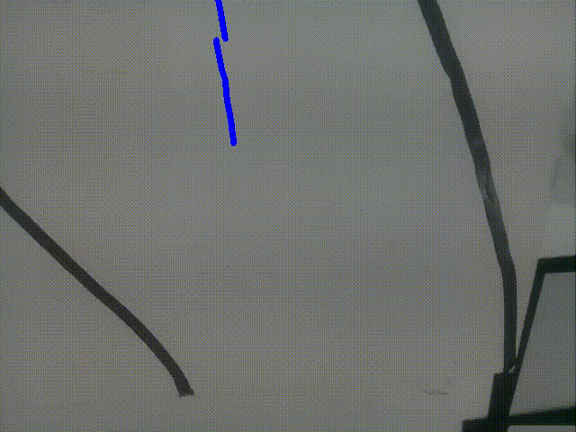

# CoDrone-daechul
PBL Project in Hanyang University : A drone with attendance instead of you!

## Members
| Name | Role | 
|:----:|:----:|
|[이하영](github.com/hy-kiera)|Develop(image)|
|[조경찬](github.com/devcre)|Develop(image)|
|[유현상](github.com/RyuHS1942)|Develop(camera)|
|[정은수](github.com/BinCHip)|Develop(codrone)|

## Goal
Create a drone that recognizes the room number and goes to the room of your choice.

 

## ROS Package


## Special Things by [정은수](github.com/BinCHip)
`CoDrone-daechul/src/codrone_move/scripts/e_drone`  
e_drone API with python 2.7

## Environment
 - server
 ```
 Ubuntu 18.04 Bionic
 catkin
 melodic
 ```
 - codrone2(raspberry pi zero w)
 ```
 Raspbian Jessie
 catkin
 kinetic
 ```

## Requirements
 - server
 ```
 python==3.6
 cv_bridge==1.13.0
 numpy==1.13.3
 rospy==1.14.3
 opencv==1.11.14
 mjpg-streamer
 ```
 - codrone2(raspberry pi zero w)
 ```
 python==2.7
 rospy==1.12.14
 ```
 
## Getting Started 
1. clone the CoDrone-daechul project on your computer(server) and codrone2
```
git clone git@github.com:hy-kiera/CoDrone-daechul.git
```
2. set the recommened environment on your computer(server)
```
pip3 install <requirements>
or
apt-get install <requirements>
```

3. go to your catkin repository and build
```
cd <YOUR_CATKIN_WORKSPACE>/CoDrone-daechul
catkin build
```

4. run `mjpg-streamer` on your raspberry pi
```
mjpg-streamer install and run it - pi
```

5. run the ROS package
 - server
 ```
 run roscore
 roslaunch lane_tracking_drone launch.launch
 ```
 - codrone(raspberry pi)
 ```
 rosrun codrone_move drone_control.py
 ```
 
## TODO
- [x] Communicate between raspberry pi 0 w and server
- [x] Send image captured by raspberry pi camera to server
- [x] Control the codrone2 by server
- [ ] ~~Detect the object(room number)~~
- [ ] ~~Get the location value of the object(room number)~~
- [x] Lane tracking
- [ ] Autonomouse flight


## [Presentation](https://docs.google.com/presentation/d/1csf4qvvp9QT9kMX25L401Xhke_v6_Ci2n7i23MN2oAo/edit?usp=sharing)